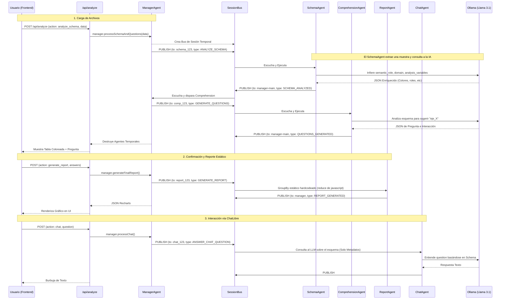
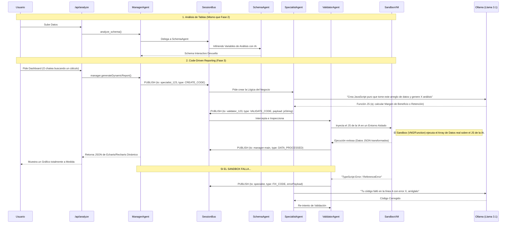

# Análisis de Arquitectura y Comunicación de Agentes DataLens AI

A continuación se presentan los diagramas de secuencia (`model schema`) que ilustran cómo se comunican los agentes dentro del `AgentBus` desde que el usuario sube un CSV hasta que interactúa con la plataforma.

## Situación Actual (Fase 1 y 2 completadas)

Actualmente, el sistema funciona con una extracción estructural y semántica impulsada por IA, pero el reporte final (gráfico de barras) es un cálculo estático predefinido en código.

---

## Próxima Implementación (Fase 3: Specialists & Sandbox)

En la Fase 3, se introducirá la capacidad "Auto-Código". El sistema no tendrá reportes fijos ni agrupaciones en duro, sino que delegará la creación del reporte a un *Especialista Programador* que escribirá JavaScript al vuelo y a un *Validador* que se cerciorará de que el código sea seguro y corra en un Sandbox aislado.

### Cambios Claves en la Fase 3:
1. **Generación Dinámica de Código:** Ya no dependemos del objeto `ReportAgent` y su reductor duro (`reduce`). Ahora el LLM es libre de generar mapas de calor, análisis de cohortes o previsiones matemáticas escribiendo el script.
2. **Validator + Sandbox:** Nunca confiaremos ciegamente en el código de la IA local, especialmente para seguridad. Se crea una capa intermedia que ejecuta el script, y si produce un error de sintaxis, se auto-corrige mandando el log de error de vuelta a la IA ("Auto-Fixing Loop").
3. **Conversación Profunda:** El `ChatAgent` podrá escalar dudas complejas ("¿Cuál fue la desviación estándar del mes pasado?") delegándolas al `SpecialistAgent` para que escriba la consulta matemática, en vez de solo contestar leyendo esquemas.
